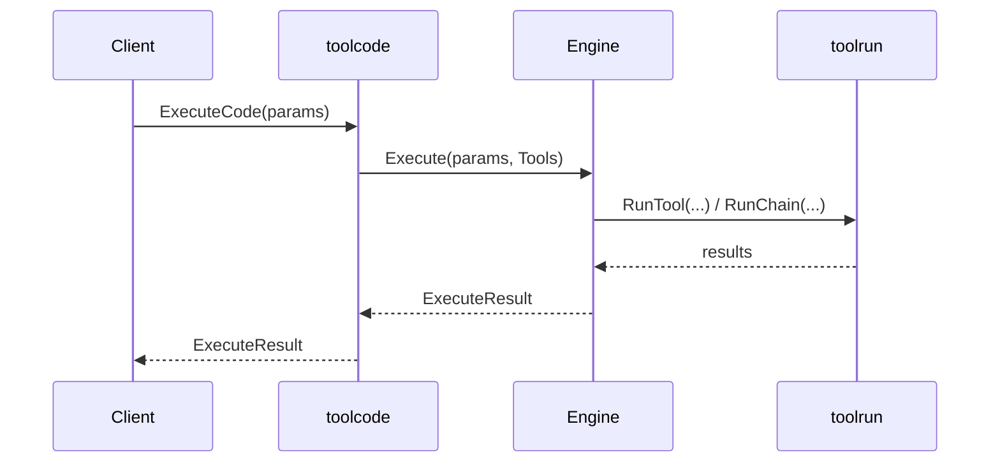

# Architecture

`toolcode` wraps tool discovery, docs, and execution into a single programmable
surface. The actual code execution is delegated to an injected `Engine`.

## Execution flow

```mermaid
flowchart LR
  A[Executor] --> B[Engine]
  A --> C[toolindex]
  A --> D[tooldocs]
  A --> E[toolrun]

  B --> F[toolruntime (optional)]
```

## Snippet lifecycle



## Control points

- `Config` controls limits and defaults
- `Engine` controls the execution sandbox
- `Tools` surface mediates tool calls and captures traces
