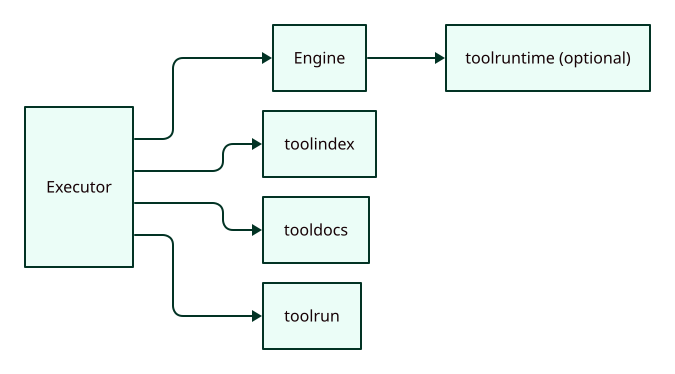

# Architecture

`toolcode` wraps tool discovery, docs, and execution into a single programmable
surface. The actual code execution is delegated to an injected `Engine`.

## Execution flow

## Snippet lifecycle

## Control points

- `Config` controls limits and defaults
- `Engine` controls the execution sandbox
- `Tools` surface mediates tool calls and captures traces
