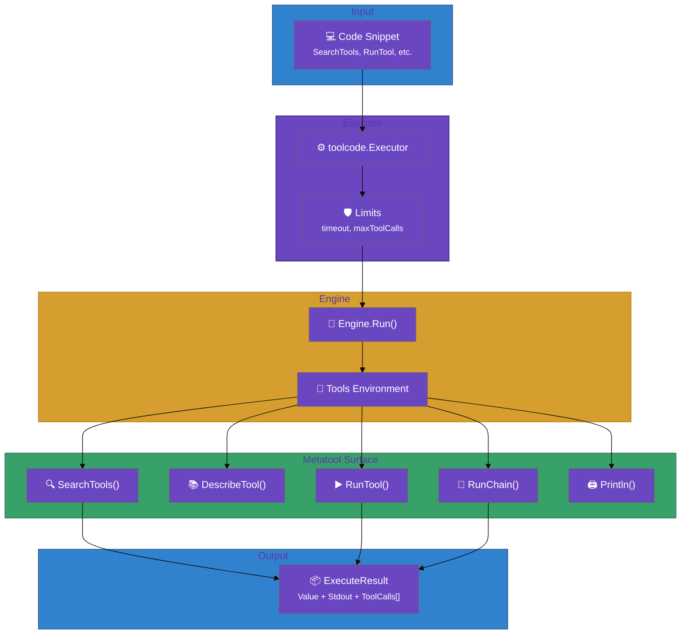
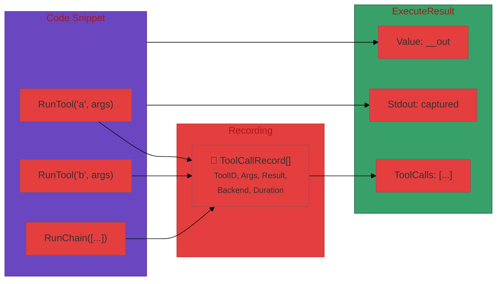

# User Journey

This journey shows how `toolcode` enables end-to-end orchestration using code snippets.

## End-to-end flow (stack view)




### Tool Call Recording



## Step-by-step

1. **Agent submits a snippet** to `execute_code`.
2. **Executor sets limits** (timeout, tool call caps).
3. **Engine runs** the snippet with a `Tools` environment.
4. **Snippet orchestrates** tools via Search/Describe/Run APIs.
5. **Result is returned** as `ExecuteResult` (Value + ToolCalls + Stdout).

## Example: pick a tool and run it

```go
code := `
results, _ := SearchTools("create issue", 5)
choice := results[0]

schema, _ := DescribeTool(choice.ID, "schema")
_ = schema // use schema in real code

res, _ := RunTool(choice.ID, map[string]any{"title": "Bug", "body": "..."})
__out = res.Structured
`

exec, _ := toolcode.NewDefaultExecutor(cfg)
result, err := exec.ExecuteCode(ctx, toolcode.ExecuteParams{Code: code})
```

## Expected outcomes

- A deterministic orchestration surface with strong limits.
- Tool call traces for audit/debugging.
- Easy integration with secure runtimes via `toolruntime` adapters.

## Common failure modes

- `ErrConfiguration` if required dependencies are missing.
- `ErrLimitExceeded` if timeouts or tool call caps are hit.
- `ErrCodeExecution` if the engine rejects the snippet.
